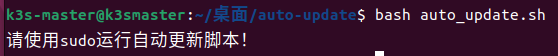
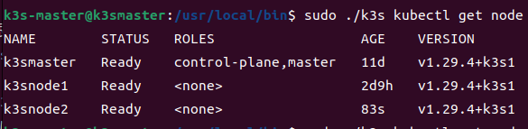
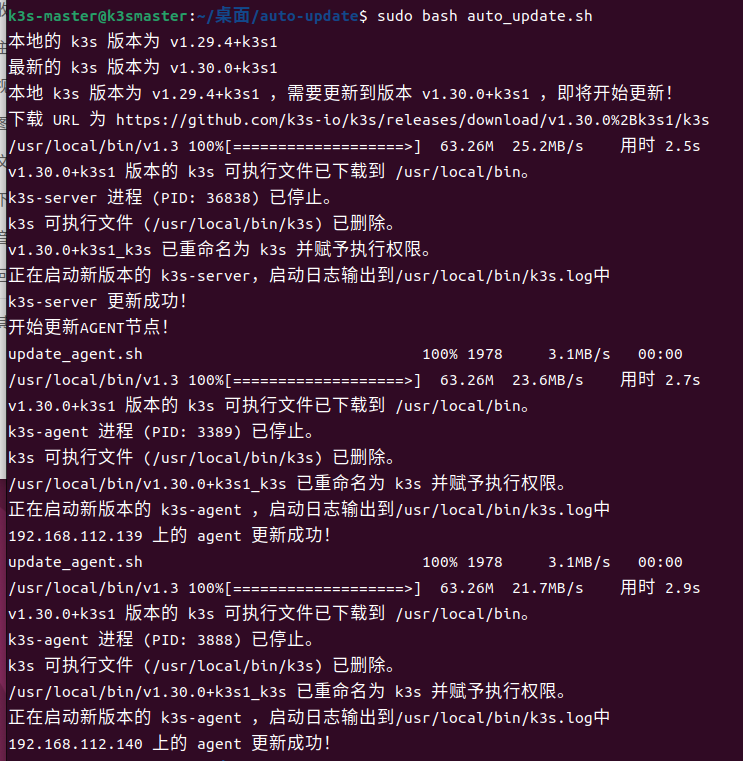
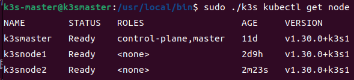
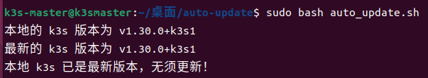

# k3s_auto_update
k3s集群自动更新脚本

### 文件结构

- `auto_update.sh`：主脚本，需要在`k3s server`节点上运行，来实现`k3s`集群的自动更新
- `update_agent.sh`：副脚本，更新过程中将会自动发送到各个`agent`节点上运行，无须手动启动该脚本
- `auto_update.config`：脚本配置文件

### 运行前准备

- 由于脚本运行时需要使用各台主机的`sudo`权限以及从`server`节点远程登录其他`agent`节点。因此在运行脚本前需要配置好`server`节点的`root`用户到各个`agent`节点的`root`用户的免密`ssh`登录。即：`server`节点上可以使用`ssh root@xxx.xxx.xxx.x`命令远程登录到其他`agent`节点的`root`用户

### 使用方法

- 配置完`auto_update.config`后在`server`节点上使用`sudo bash auto_update.sh`运行主脚本即可

### 测试截图

- 如果未使用`sudo`运行主脚本，则提示如下

  

- 更新前的节点信息如下

  

- 在`server`节点上运行主脚本进行版本更新。更新完毕后所有节点上的`k3s`都会在后台进行运行，关闭更新脚本所在的终端不会使各个节点上的`k3s`停止运行

  

- 更新后的节点信息如下

- 更新完毕后再次运行自动更新脚本则会提示无需更新

